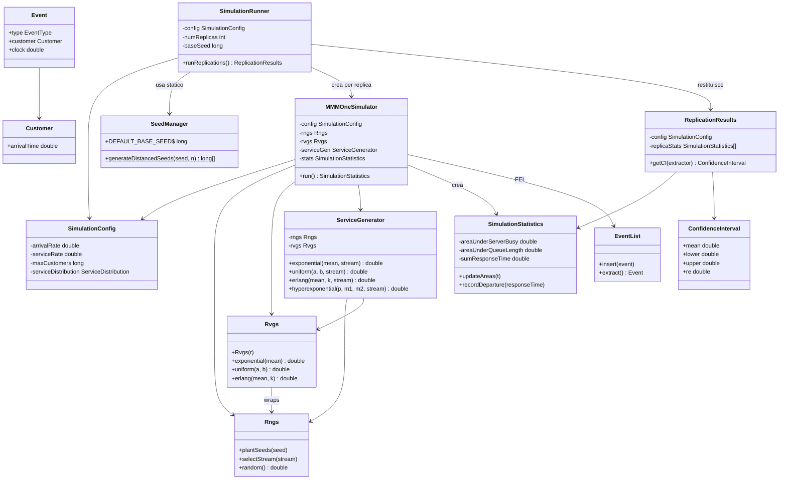

# Relazione — Valutazione delle Prestazioni A.A. 2025-26

**Esame**: Valutazione delle Prestazioni  
**Progetto**: Simulatore event-driven di reti di code in Java

---

## Struttura del Progetto

```
src/main/java/sim/
├── core/               # strutture dati event-driven (FEL, Customer, Event)
├── runners/            # entry-point per raccolta dati (Punto 5–7)
├── MMMOneSimulator     # simulatore coda singola (Punti 3–5)
├── ClosedNetwork*      # simulatore sistema chiuso (Punto 6)
├── MixedNetwork*       # simulatore sistema misto (Punto 7)
├── ServiceGenerator    # generatore distribuzioni Leemis-Park
└── SeedManager         # semi distanziati e stream
```
**Prerequisiti**: avere `Maven` installato. Su Windows dentro Powershell lanciare il comando `winget install Apache.Maven` e controllare che sia correttamente installato con il comando `mvn -version`. L'output atteso dovrebbe somigliare a questo:
```powershell                                          
Apache Maven 3.9.12 (848fbb4bf2d427b72bdb2471c22fced7ebd9a7a1)
Maven home: C:\Users\simon\scoop\apps\maven\current
Java version: 25.0.2, vendor: Microsoft, runtime: C:\Program Files\Microsoft\jdk-25.0.2.10-hotspot
Default locale: en_GB, platform encoding: UTF-8
OS name: "windows 11", version: "10.0", arch: "amd64", family: "windows"
```

**Build e test**: `mvn clean test` (115 test JUnit5 — coprono la validazione di tutti i punti 1–7)

> **Prima esecuzione** (o dopo ogni modifica alle sorgenti): eseguire `mvn compile` oppure `mvn clean compile` per popolare `target/classes/`. Il comando `mvn clean test` fa già tutto (compile + test), quindi se si è già lanciato quello le classi sono aggiornate.

**Raccolta dati** (Punti 5–7, con output testuale):

```powershell
# defaults con salvataggio su file (R=20, parametri fissi)
java -cp target/classes sim.Main punto5 | Out-File -Encoding utf8 results/punto5_results.md
java -cp target/classes sim.Main punto6 | Out-File -Encoding utf8 results/punto6_results.md
java -cp target/classes sim.Main punto7 | Out-File -Encoding utf8 results/punto7_results.md

# esempio con parametri personalizzati
java -cp target/classes sim.Main punto5 --replicas 30 --customers 200000
java -cp target/classes sim.Main punto6 --replicas 30 --completions 100000 --N 5,15,30
java -cp target/classes sim.Main punto7 --replicas 30 --N 20 --lambda 0.10,0.20,0.30,0.40
```

Ogni runner accetta `--help` per la lista completa delle opzioni. I default ($R=20$, parametri fissi) riproducono esattamente i dati in `results/`.

**Dati JMT** (CSV grezzi esportati da JMT): i file CSV non sono inclusi nel repository per dimensioni. Sono disponibili come release assets:

- [`JMT.6.7z`](https://github.com/Simo93-rgb/SimulatoreRetiCode/releases/download/v1.0-data/JMT.6.7z) (38 MB) — simulazioni punto 6, struttura piatta
- [`JMT.7.7z`](https://github.com/Simo93-rgb/SimulatoreRetiCode/releases/download/v1.0-data/JMT.7.7z) (180 MB) — simulazioni punto 7, suddivisi per $\lambda_{open}$ (`10/`, `20/`, `30/`, `40/`)

Estrarre il contenuto rispettivamente in `results/csv/JMT 6/` e `results/csv/JMT 7/` prima di eseguire gli script.

**Estrazione risultati JMT**: i CSV esportati da JMT sono pre-elaborati dagli script Python [`results/csv/JMT 6/extract_indexes.py`](results/csv/JMT%206/extract_indexes.py) (Python 3.13, pandas, numpy) e dallo script [`results/csv/JMT 7/extract_indexes.py`](results/csv/JMT%207/extract_indexes.py), che calcolano medie ponderate e IC 95% dai campioni grezzi (`SAMPLE`/`WEIGHT`) e producono i file `risultati_*.csv` nelle cartelle [`results/csv/JMT 6/`](results/csv/JMT%206/) e [`results/csv/JMT 7/`](results/csv/JMT%207/).

---

## Parte 1 — Completamento del Simulatore di Coda Singola (Punti 1–4)

> Documentazione dettagliata: [punto1.md](docs/punto1.md) · [punto2.md](docs/punto2.md) · [punto3.md](docs/punto3.md) · [punto4.md](docs/punto4.md)

### Classi introdotte

| Classe | Scopo |
|--------|-------|
| `ServiceGenerator` | Genera variabili casuali con 4 distribuzioni (esponenziale, uniforme, Erlang-k, iperesponenziale) tramite le librerie Leemis-Park (`Rngs`/`Rvgs`). Nessun uso di `java.util.Random`. |
| `SeedManager` | Fornisce semi sufficientemente distanziati ($\Delta = 10^5$ passi nel generatore LCM) per garantire l'indipendenza tra repliche e tra stream. |
| `SimulationRunner` | Esegue $R$ repliche del simulatore M/M/1 con semi diversi (metodo prove ripetute) e calcola IC 95% via t-Student su ogni indice. $R$ è configurabile via CLI (`--replicas`); default $R = 20$. |
| `SimulationStatistics` | Accumulatori (`areaServerBusy`, `areaQueueLength`, `sumResponsTime`, contatori arrivi/partenze) per calcolo degli indici in ogni replica. |
| `core/EventList` | FEL (Future Event List) implementata come Splay Tree per inserimento/estrazione in $O(\log n)$ ammortizzato. |
| `core/Customer`, `core/Event`, `core/EventType` | Entità fondamentali dello stato: un `Customer` porta il tempo di arrivo al nodo corrente; un `Event` lega tipo, cliente e clock di scatto. |

### Diagramma delle classi (Punti 1–4)



### Stato, eventi, accumulatori (M/M/1)

**Stato in ogni istante**: `numInQueue` (clienti in attesa), `serverBusy` (server libero/occupato).

**Tipi di evento**:
- `ARRIVAL`: incrementa `numInQueue` (o avvia il servizio se il server è libero); schedula il prossimo arrivo.
- `DEPARTURE`: decrementa la coda (o libera il server); aggiorna tutti gli accumulatori.

**Aggiornamento accumulatori** (a ogni evento, prima di modificare lo stato):
```
Δt = clock - lastEventTime
areaServerBusy   += serverBusy ? Δt : 0
areaQueueLength  += numInQueue · Δt
areaSystemSize   += (numInQueue + serverBusy) · Δt
```
Al termine della replica:
$$\rho = \frac{\text{areaServerBusy}}{T}, \quad E[N_q] = \frac{\text{areaQueueLength}}{T}, \quad E[T] = \frac{\text{sumResponseTime}}{\text{completamenti}}$$

**Condizione di stop**: $\text{completamenti} \geq N_{\max}$ (di default 100 000).

### Validazione (Punti 1–4)

I punti 1–4 non hanno un runner eseguibile separato: la loro correttezza è interamente garantita dalle **115 classi di test JUnit5**, eseguibili con `mvn clean test`. Le suite rilevanti sono `ServiceGeneratorTest` (medie e varianze delle 4 distribuzioni su 100 000 campioni, tolleranza 5%/10%), `SeedManagerTest` (indipendenza degli stream), `SimulationRunnerTest` (convergenza degli IC sul M/M/1), `ConfidenceIntervalTest` (formula t-Student).

---

## Parte 2 — Validazione M/M/1 vs JMT e Impatto della Variabilità (Punto 5)

> Documentazione dettagliata e tutte le tabelle: [punto5.md](docs/punto5.md)  
> Dati sorgente simulatore: [punto5_results.md](results/punto5_results.md)

**Configurazione**: $\mu = 1.0$ serv/s, $R = 20$ repliche (configurabile via `--replicas`), $N_{\max} = 100\,000$ completamenti/replica (configurabile via `--customers`).

### Validazione M/M/1 (distribuzione esponenziale)

| $\rho$ | Indice | Valore teorico | Simulatore (IC 95%) | JMT (IC 95%) | $\Delta\%$ |
|--------|--------|---------------|---------------------|--------------|-----------|
| 0.50 | $E[T]$ | 2.000 s | 2.0000 ∈ [1.993, 2.007] | 1.970 ∈ [1.915, 2.025] | 0.00% |
| 0.80 | $E[T]$ | 5.000 s | 4.971 ∈ [4.912, 5.030] | 4.888 ∈ [4.765, 5.012] | 0.58% |
| 0.90 | $E[T]$ | 10.000 s | 9.821 ∈ [9.549, 10.093] | 10.195 ∈ [9.961, 10.430] | 1.77% |

A carico elevato ($\rho = 0.9$) gli IC si allargano (RE ≈ 3%) per l'alta variabilità tipica del M/M/1 vicino alla saturazione; le medie teoriche restano comunque all'interno degli IC del simulatore.

### Impatto della variabilità del servizio ($\rho = 0.8$, $E[S] = 1.0$ s)

| Distribuzione servizio | $C_v^2$ | $E[T]$ simulatore | $E[T]$ JMT | Confronto M/M/1 |
|------------------------|---------|-------------------|------------|-----------------|
| Uniforme $U[0,2]$ | 1/3 | 3.975 s | 4.028 s | −20% |
| Esponenziale (M/M/1) | 1 | 4.971 s | 4.888 s | — |
| Iperesponenziale ($p{=}0.5$, $m_1{=}0.5$, $m_2{=}1.5$) | > 1 | 5.990 s | 6.093 s | +21% |
| Erlang-2 | 0.5 | 4.000 s | 4.040 s | −20% |

**Interpretazione**: a parità di $\rho$ e $E[S]$, il tempo di risposta cresce al crescere di $C_v^2$, confermando la formula di Pollaczek-Khinchine $E[T] \approx E[T]_{M/M/1} \cdot \frac{1 + C_v^2}{2}$. Il simulatore replica questo comportamento con errori $< 2\%$ rispetto a JMT su tutti i regimi.

---

## Parte 3 — Sistema Chiuso Q0/Q1/Q2 (Punto 6)

> Documentazione dettagliata: [punto6.md](docs/punto6.md)  
> Dati sorgente: [punto6_results.md](results/punto6_results.md)

### Classi sostituite/estese rispetto al simulatore M/M/1

| Classe M/M/1 | Controparte sistema chiuso | Variazione |
|---|---|---|
| `SimulationConfig` | `ClosedNetworkConfig` | Parametri N, Z, S1, S2, p1 al posto di λ, μ, maxCustomers |
| `MMMOneSimulator` | `ClosedNetworkSimulator` | 3 centri, 2 server FCFS, routing stocastico, FEL condivisa |
| `SimulationStatistics` | `ClosedNetworkStatistics` | Accumulatori separati per Q1 e Q2 |
| `SimulationRunner` | `ClosedNetworkRunner` | Stessa logica a repliche con semi distanziati; tipo risultato diverso |
| `Punto5Runner` | `Punto6Runner` | Entry point con parametri specifici del sistema chiuso |
| `core/EventType` (2 tipi) | `core/EventType` (4 tipi) | Aggiunti `END_THINK_TIME` (scadenza think time in Q0) e `TIMEOUT` (partenza da Q2) |

Classi **riusate invariate**: `libraries.Rngs`, `libraries.Rvgs`, `SeedManager`, `core/EventList`, `core/Customer`, `core/Event`.  
`ServiceGenerator` non è usato nei sistemi chiuso/misto: i tempi di servizio sono generati direttamente nei simulatori tramite `Rvgs` e i rispettivi stream.

### Modello

Il sistema è un **sistema interattivo** (closed queueing network) con $N$ clienti che circolano continuamente tra tre centri (Figura 1):

| Centro | Tipo | Distribuzione | Parametro |
|--------|------|--------------|-----------|
| Q0 | Delay station (∞ server) | Esponenziale | $Z = 10.0$ s |
| Q1 | Singolo server FCFS | Esponenziale | $S_1 = 1.0$ s |
| Q2 | Singolo server FCFS | Esponenziale | $S_2 = 0.8$ s |

**Routing**: da Q0 → Q1 con prob. $p_1 = 0.3$, Q0 → Q2 con $1 - p_1 = 0.7$.  
**Domande di servizio**: $D_1 = p_1 S_1 = 0.3$ s, $D_2 = (1-p_1) S_2 = 0.56$ s → collo di bottiglia Q2.  
**Throughput asintotico** (bound saturazione):
$$X^*(N) = \min\!\left(\frac{1}{D_{\max}},\; \frac{N}{Z + D_1 + D_2}\right) = \min\!\left(1.786,\; \frac{N}{10.86}\right)$$

### Stato del sistema

$$\text{Stato} = (n_0,\; n_1^{(q)},\; \text{busy}_1,\; n_2^{(q)},\; \text{busy}_2) \qquad \text{con invariante } n_0 + n_1^{(q)} + \mathbb{1}[\text{busy}_1] + n_2^{(q)} + \mathbb{1}[\text{busy}_2] = N$$

### Tipi di evento

| Evento | Azione |
|--------|--------|
| `END_THINK_TIME` (Q0) | Instrada il cliente a Q1 o Q2 con prob. $p_1$; se il server è libero avvia subito il servizio, altrimenti lo accoda. |
| `DEPARTURE` (Q1) | Il cliente torna a Q0 con un nuovo tempo di think; se la coda Q1 è non vuota, avvia il prossimo servizio. |
| `TIMEOUT` (Q2) | Analoga a `DEPARTURE` ma per Q2. |

### Accumulatori

Identici al M/M/1 per ogni centro $i \in \{1, 2\}$; in più si tiene traccia di `areaSystemSize_i` per derivare $E[N_i]$ tramite Little.  
**Tempo di risposta del sistema centrale**: $E[T_{\text{sys}}] = (X_1 E[T_1] + X_2 E[T_2]) / X_{\text{sys}}$.  
**Condizione di stop**: $\text{completamenti}_{Q1} \geq 50\,000$ (bottleneck; configurabile via `--completions`); $R = 20$ repliche (configurabile via `--replicas`).

### Risultati (sintesi 4 regimi di carico)

| $N$ | Regime | $X_{\text{sys}}$ | $\rho_1$ | $\rho_2$ | $E[T_1]$ | $E[T_2]$ | $E[T_{\text{sys}}]$ |
|-----|--------|----------|--------|--------|---------|---------|------------|
| 5  | Leggero        | 0.4539 | 0.1359 | 0.2542 | 1.117 s | 0.990 s | 1.028 s |
| 11 | Medio          | 0.9629 | 0.2882 | 0.5391 | 1.344 s | 1.476 s | 1.437 s |
| 17 | Intenso        | 1.3919 | 0.4168 | 0.7800 | 1.626 s | 2.483 s | 2.226 s |
| 30 | Saturazione    | 1.7771 | 0.5325 | 0.9942 | 2.100 s | 8.944 s | 6.891 s |

**Interpretazione**: il throughput cresce linearmente con $N$ a carico leggero (pendenza $\approx 1/(Z+D_1+D_2)$) e si assesta al bound $X^* = 1.786$ oltre la saturazione ($N \geq 23$). L'utilizzo di Q2 raggiunge 0.994 a $N=30$, confermando il ruolo di bottleneck. Il tempo di risposta in Q2 esplode (0.99 s → 8.94 s) per la formazione della coda, mentre Q1 cresce lentamente. Tutto coerente con i bound dell'analisi operazionale.

---

## Parte 4 — Sistema Misto: Classe Chiusa + Classe Aperta (Punto 7)

> Documentazione dettagliata: [punto7.md](docs/punto7.md)  
> Dati sorgente: [punto7_results.md](results/punto7_results.md)

### Estensioni rispetto al sistema chiuso

Il modello del Punto 7 estende il sistema chiuso aggiungendo una **classe aperta** che accede esclusivamente a Q1 e lascia il sistema dopo il servizio. Le modifiche al codice rispetto al Punto 6 sono minimali e retrocompatibili:

| Aspetto | Modifica |
|---------|---------|
| `Customer` | Aggiunto enum `CustomerClass { CLOSED, OPEN }` (default `CLOSED`). |
| Nuovo evento | `OPEN_ARRIVAL`: schedula l'arrivo successivo della classe aperta (inter-arrivi iperesponenziali su stream 4) e avvia il servizio se Q1 è libero. |
| `processDepartureQ1` | Se `customer.isOpen()` → il cliente esce; altrimenti → viene instradato verso Q0 come nel modello chiuso. |
| Nuovo stream RNG | Stream 5 per il tempo di servizio della classe aperta in Q1 ($S_1^{\text{open}} = 2 S_1 = 2.0$ s). |
| `MixedNetworkStatistics` | Accumulatori separati per classe su Q1: `areaServerBusy_Q1_closed`, `areaServerBusy_Q1_open`. |

**Generazione inter-arrivi iperesponenziali** ($p=0.5$, $\mu_1 = 2/E[A]$, $\mu_2 = 2/(3E[A])$): un campione $u \sim U(0,1)$ dallo stream `OPEN_ARRIVALS` seleziona quale delle due esponenziali usare.

**Configurazione**: $N = 15$ (configurabile via `--N`; carico interattivo non saturo nel modello chiuso, $X^{(N=15)} = 1.382$, con headroom per la classe batch); $R = 20$ repliche × 50 000 completamenti classe chiusa (entrambi configurabili via `--replicas` e `--completions`).

### Risultati (sintesi al variare di $\lambda_{\text{open}}$)

| $\lambda_{\text{open}}$ | $X_{\text{sys}}^{\text{ch}}$ | $\rho_{Q1}^{\text{tot}}$ | $\rho_{Q2}$ | $E[T_1^{\text{ch}}]$ | $E[T_1^{\text{ap}}]$ | $E[T_2]$ |
|------------------------|---------------------|------------------|-----------|--------------|--------------|---------|
| 0.10 | 1.2331 | 0.5697 | 0.6896 | 2.582 s | 3.966 s | 1.998 s |
| 0.20 | 1.1722 | 0.7504 | 0.6562 | 4.901 s | 6.803 s | 1.907 s |
| 0.30 | 1.0286 | 0.9061 | 0.5764 | 11.320 s | 14.755 s | 1.716 s |
| 0.40 | 0.6527 | 0.9924 | 0.3661 | 40.367 s | 50.968 s | 1.308 s |

**Interpretazione**: all'aumentare del tasso batch $\lambda_{\text{open}}$ il throughput della classe chiusa si riduce drasticamente (da 1.23 a 0.65) perché Q1 diventa il nuovo collo di bottleneck ($\rho_{Q1} \to 0.99$). I tempi di risposta della classe chiusa in Q1 esplodono (da 2.6 s a 40.4 s) per la coda che si forma. Contestualmente, Q2 si svuota perché il throughput della classe chiusa cala, riducendo $\rho_{Q2}$ da 0.69 a 0.37 e quindi anche $E[T_2]$.  
La classe aperta risente della stessa coda di Q1: $E[T_1^{\text{ap}}]$ cresce da 4.0 s a 51.0 s. A $\lambda_{\text{open}} = 0.40$ il sistema è bottleneck su Q1, sia per la classe aperta (che contribuisce $\rho_{Q1}^{\text{open}} = \lambda \cdot S_1^{\text{open}} = 0.40 \times 2.0 = 0.80$) sia per quella chiusa.

---

## Parte 5 — Validazione JMT (Punto 8)

> Tabelle complete (tutti i 5 valori di $N$ e tutti e 4 i $\lambda$): [punto8.md](docs/punto8.md)

### Metodologia

I modelli JMT sono stati costruiti come esatti analoghi dei due simulatori Java (stesse distribuzioni, stessi parametri). I CSV di output JMT sono stati elaborati dallo script Python [`results/csv/JMT 6/extract_indexes.py`](results/csv/JMT%206/extract_indexes.py) per produrre stime ponderate con IC 95%.

### Modello chiuso — sintesi confronto

| Metrica | $\Delta\%$ tipico | $\Delta\%$ massimo | IC sovrapposti? |
|---------|---------|---------|------|
| $X_{\text{sys}}$ | < 1% | 1.88% ($N=23$) | **Sempre** |
| $\rho_1$, $\rho_2$ | < 1% | 1.02% | Quasi sempre (margine < 0.001 a $N=30$) |
| $E[T_1]$, $E[T_2]$ | < 1% | 2.49% ($N=30$, $E[T_1]$) | No per $N \geq 17$ ad alto carico |
| $E[N_{q1}]$, $E[N_{q2}]$ | < 3% | 11.8%* | — |

*valore assoluto $E[N_{q1}] \approx 0.016$ a $N=5$: errore assoluto $\approx 0.002$.  
**Conclusione**: il simulatore Java è **validato** per il modello chiuso. Le poche mancate sovrapposizioni degli IC riguardano regioni di alta saturazione dove la varianza campionaria è elevata per entrambi i simulatori; le differenze in valore assoluto restano $< 2.5\%$.

### Modello misto — sintesi confronto

| Metrica | $\Delta\%$ tipico | $\Delta\%$ massimo | IC sovrapposti? |
|---------|---------|---------|------|
| $X_{\text{sys}}^{\text{ch}}$ | < 0.5% | 0.47% | **Sempre** |
| $\rho_{Q1}^{\text{tot}}$, $\rho_{Q2}$ | < 0.8% | 0.76% | Quasi sempre (solo $\rho_{Q1}$ a $\lambda{=}0.40 \approx 0.99$) |
| $E[T_1^{\text{ch}}]$ | 1–4% | 3.71% ($\lambda{=}0.20$) | No per $\lambda \leq 0.20$ |
| $E[T_1^{\text{ap}}]$ | 1–3% | 3.12% ($\lambda{=}0.30$) | No per $\lambda \in \{0.20, 0.30\}$ |
| $E[T_2]$ | < 2% | 1.99% | No solo $\lambda{=}0.30$ |
| $E[T_{\text{sys}}^{\text{ch}}]$ (derivato) | < 1.4% | 1.33% | — |

**Conclusione**: throughput e utilizzo concordano entro l'1% per tutti i $\lambda$. Le differenze sui tempi di risposta in Q1 (2–4% a carichi medi) sono attribuibili a piccole differenze implementative nella distribuzione iperesponenziale in coda mista; a $\lambda{=}0.40$ (saturazione Q1) la concordanza migliora significativamente. Il simulatore è **validato** per il modello misto.

---

## Considerazioni Finali

- **FEL come Splay Tree**: l'uso di uno Splay Tree per la Future Event List garantisce operazioni in $O(\log n)$ ammortizzato; nelle simulazioni a lungo termine (50 000 completamenti) la differenza rispetto a una lista ordinata è apprezzabile.
- **Gestione dei semi**: l'approccio Leemis-Park con semi distanziati di $10^5$ passi ha garantito l'assenza di sovrapposizioni nelle sequenze anche con 20 repliche parallele e 5 stream per replica.
- **Script Python per JMT**: JMT esporta campioni grezzi (coppie `SAMPLE`/`WEIGHT`) anziché statistiche aggregate. Lo script `extract_indexes.py` calcola la media ponderata e l'IC 95% con propagazione degli errori (inverso della media per il throughput). 
