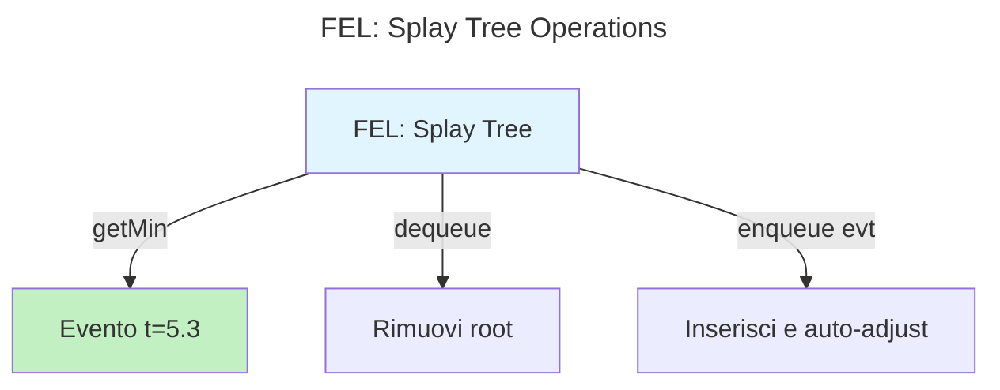
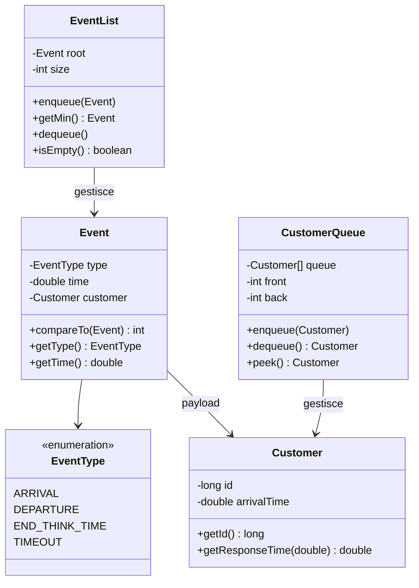

# Step 2.A — Architettura Event-Driven per Simulazione DES

## Obiettivo

Implementare le strutture dati fondamentali per un simulatore a eventi discreti (DES - Discrete Event Simulation), migrando componenti dal simulatore proposto con refactoring per estensibilità al sistema misto Interactive/Batch.

---

## Architettura Event-Driven

### Pattern Next-Event Simulation

Il simulatore adotta il pattern **Next-Event** (Leemis Cap. 8), alternativa al **time-stepping** per efficienza computazionale quando gli eventi sono rari rispetto all'orizzonte temporale.

**Loop principale**:
```shell
WHILE (condizione_stop_non_raggiunta) DO
    event ← FEL.getMin()          // Estrai evento imminente
    FEL.dequeue()                 // Rimuovi da lista
    clock ← event.time            // Avanza clock simulato
    PROCESS(event.type)           // Esegui logica evento
END WHILE
```

**Invariante temporale**: Gli eventi vengono processati in ordine cronologico crescente, garantendo causalità nella simulazione.

---

## Strutture Dati Implementate

### 1. Future Event List (FEL)

**Requisito**: Struttura ordinata per timestamp con operazioni efficienti di inserimento (`enqueue`) ed estrazione del minimo (`getMin` + `dequeue`).

**Implementazione**: **Splay Tree** auto-bilanciante [Sleator & Tarjan, 1985].

**Complessità ammortizzata**: $O(\log n)$ per tutte le operazioni.

**Razionale scelta**:

| Struttura | Complessità | Accesso sequenziale | Decisione |
|-----------|-------------|---------------------|-----------|
| Min-Heap (`PriorityQueue`) | $O(\log n)$ worst-case | Standard | ❌ |
| **Splay Tree** | $O(\log n)$ ammortizzata | **Ottimizzata** | ✅ |
| Skip List | $O(\log n)$ attesa | Standard | ❌ |

**Motivazione**: Il pattern di accesso DES è **sempre sequenziale** (estrazione ripetuta del minimo). La Splay Tree amortizza il costo spostando nodi frequentemente acceduti vicino alla root, riducendo il costo ammortizzato per accessi futuri sulla stessa sottoregione temporale.

**Trade-off**: Complessità implementativa maggiore vs performance teoricamente ottimale. Se profiling rivela overhead eccessivo, migrazione a `PriorityQueue<Event>` è immediata (interfaccia identica).



**Classe**: `sim.core.EventList`

---

### 2. Customer Queue

**Requisito**: Coda FIFO per customer in attesa di servizio.

**Implementazione**: Array circolare dinamico con auto-espansione (raddoppio dimensione).

**Operazioni**: $O(1)$ per `enqueue`, `dequeue`, `peek`; $O(n)$ per `grow` (raro, ammortizzato $O(1)$).

**Classe**: `sim.core.CustomerQueue`

---

## Design delle Classi Core

### Separazione Event/Customer

**Decisione critica**: `Event` e `Customer` sono **classi distinte**.

**Razionale**:
- **Event**: Messaggio nel futuro ("cosa accadrà e quando")
- **Customer**: Entità processata ("chi viene servito")

**Alternativa rifiutata** (simulatore proposto): Riutilizzare `Event` come descriptor del customer.

**Motivazione del rifiuto**: 
1. **Estensibilità Step 3**: Le classi Interactive/Batch richiedono campi specifici (es. `remainingThinkTimes`, `priority`, `jobClass`). Mescolarli con campi di `Event` viola Single Responsibility Principle.
2. **Testabilità**: Unit test isolati per logica eventi vs logica job.
3. **Semantica**: Il campo `time` di `Event` ha significato diverso in FEL ("quando") vs CustomerQueue ("arrivalTime").

### Diagramma delle Classi



---

## Type Safety: Enum vs Costanti Int

**Implementazione**: `EventType` come `enum` invece di costanti `public static final int`.

**Confronto**:

```java
// ❌ Approccio libro (non type-safe)
public static final int ARRIVAL = 1;
public static final int DEPARTURE = 2;
Event e = new Event(999, time); // Compila, ma 999 è invalido

// ✅ Nostro approccio
public enum EventType { ARRIVAL, DEPARTURE, ... }
Event e = new Event(EventType.ARRIVAL, time); // Type-safe
Event bad = new Event(999, time); // ❌ Errore compilazione
```

**Vantaggi chiave**:
1. **Compile-time safety**: Compilatore previene valori invalidi
2. **Switch exhaustiveness**: Warning se manca un `case` (Java 14+)
3. **Refactoring**: IDE rinomina automaticamente in tutto il codebase
4. **Debug**: `toString()` automatico ("ARRIVAL" vs "1")

---

## Gestione Campi Package-Private

**Problema**: La Splay Tree richiede accesso diretto ai campi `leftlink`, `rightlink`, `uplink` di `Event` e al campo `time` per confronti.

**Soluzione adottata**:
```java
public class Event {
    final double time;                    // Package-private
    Event leftlink, rightlink, uplink;    // Package-private
}
```

**Razionale**: Compromesso tra **encapsulation** e **performance**. Alternativa (getter) aggiunge overhead in loop critici di `enqueue`. Package-private limita accesso a `sim.core.*`, mantenendo incapsulamento verso esterno.

---

## Meccanismo di Ordinamento Eventi

**Interfaccia**: `Event implements Comparable<Event>`

**Implementazione**:
```java
@Override
public int compareTo(Event other) {
    return Double.compare(this.time, other.time);
}
```

**Proprietà**: Ordinamento totale su $\mathbb{R}^+$ (timestamp).

**Gestione tie**: Eventi con timestamp identico preservano ordine di inserimento (FIFO per stesso tempo). Critico per correttezza: se ARRIVAL e DEPARTURE avvengono allo stesso clock tick, l'ordine di processing può influenzare statistiche.

---

## Validazione Funzionale

### Test EventList: Ordinamento Temporale

**Obiettivo**: Verificare che eventi inseriti fuori ordine vengano estratti in sequenza cronologica.

**Procedura**:
1. Inserire $n$ eventi con timestamp random $t_i \in [0, T]$
2. Estrarre tutti con `getMin()` + `dequeue()`
3. Verificare $t_1 \leq t_2 \leq \ldots \leq t_n$

**Test automatizzato**: `EventListTest.testSequentialGetMinDequeue()` e stress test con $n=1000$.

### Test CustomerQueue: FIFO Strict

**Proprietà**: $\forall i < j: \text{enqueue}(c_i) \text{ precede } \text{enqueue}(c_j) \implies \text{dequeue}() = c_i \text{ precede } c_j$

**Test automatizzato**: `CustomerQueueTest.testFIFOOrder()` e verifica post-grow (array expansion).

---

## Confronto con Simulatore Proposto

| Aspetto | Simulatore Libro | Nostro Refactoring | Motivazione |
|---------|------------------|-------------------|-------------|
| Event Type | `int` costanti | `enum EventType` | Type safety, estensibilità |
| Customer | Riusa `Event` | Classe separata | SRP, Step 3 ready (classi job) |
| Immutabilità | Fields mutabili | `final` dove possibile | Riduzione bug concorrenza |
| Javadoc | Minimo | Completo | Standard accademico/industriale |

---

## Preparazione per Step 2.B

Le strutture implementate costituiscono la **base event-driven** per il simulatore M/M/1:

- **EventList**: Gestirà FEL con eventi `ARRIVAL`/`DEPARTURE`
- **CustomerQueue**: Coda di attesa quando server occupato
- **Event**: Trasporterà riferimento a `Customer` per tracciare statistiche individuali (arrival time → response time)

**Prossimo step**: Implementazione loop principale, integrazione `ServiceGenerator` (Step 1), e gestione stream RNG indipendenti per arrivi/servizi.

---

## File Implementati

```
src/main/java/sim/core/
├── EventType.java        # Enum tipi evento
├── Customer.java         # Entità job/customer
├── Event.java            # Messaggio evento futuro
├── EventList.java        # FEL (Splay Tree)
└── CustomerQueue.java    # FIFO queue

src/test/java/sim/core/
├── CustomerTest.java
├── EventTest.java
├── EventListTest.java
└── CustomerQueueTest.java
```

**Test suite**: 34 test JUnit5 (100% metodi pubblici).

