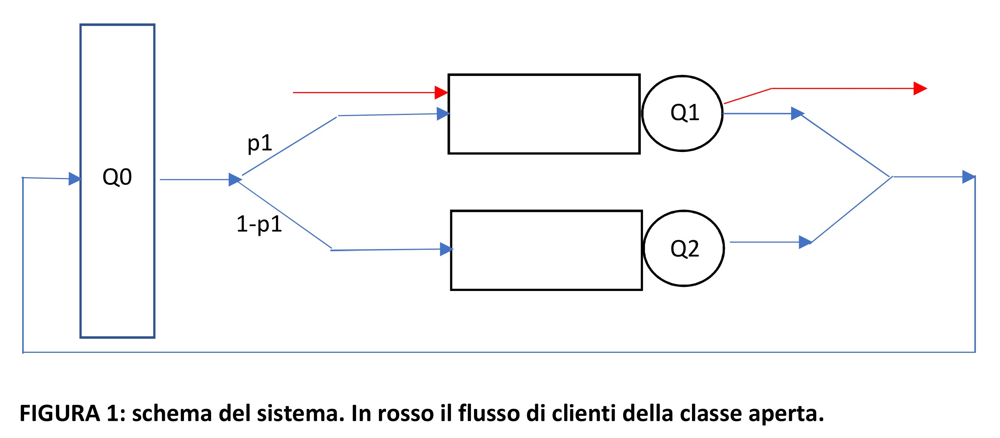

Esercizio pratico valido per l’esame di Valutazione delle Prestazioni, A.A. 2025-26 

Realizzare un simulatore in Java (o altro linguaggio general purpose a scelta), partendo dal simulatore di coda 

singola descritto nel libro di testo (Cap. 4) il cui codice è a disposizione sul DIR. 

MODIFICARE IL SIMULATORE, aggiungendo le seguenti caratteristiche: 

1) Generazione dei numeri casuali : integrare nel simulatore un generatore di numeri casuali basato sul metodo 

congruente moltiplicativo (per generare U(0,1) ) descritto nel libro Leemis-Park (la cui descrizione è 

disponibile sul DIR insieme ad una implementazione delle relative funzioni); potete usare le classi Rng e Rvg 

(la seconda include le funzioni per generare un certo numero di distribuzioni di probabilità) reperibili sulla 

pagina web del prof. Leemis (vedere slides). Esempi di distribuzioni di probabilità da includere per poter fare 

alcuni esperimenti con diverse distribuzioni: l’esponenziale (1 parametro corrispondente alla media o al tasso 

che è uguale a (1/media)), l’uniforme nel range (min,max), la erlang a k stadi che ha 2 parametri: la media e 

il numero di stadi (k), la iperesponenziale con tre parametri, p (probabilità di scegliere la prima distribuzione 

esponenziale), il tasso (o la media) della prima esponenziale, il tasso (o media) della seconda esponenziale. 

La erlang ha un coefficiente di variazione < 1 (tanto minore quanti più stadi ci sono, a parità di media), 

l’esponenziale ha un coefficiente di variazione = 1, l’iperesponenziale ha un coefficiente di variazione > 1. 

2) Aggiungere i metodi per ottenere una lista di semi iniziali sufficientemente distanziati da usare per replicare 

la stessa simulazione più volte con semi diversi (notare che in questo modo si possono lanciare più 

simulazioni in parallelo con garanzia di non sovrapposizione delle sequenze generate), e da usare per gestire 

sequenze casuali indipendenti per diverse attività in ciascuna esecuzione (es. sequenza dei tempi di inter-

arrivo, la sequenza dei tempi di servizio richiesti dai clienti che raggiungono il centro di servizio). Potete 

usare le classi Rngs e Rvgs reperibili sulla pagina web del prof. Leemis (vedere slides). 

3) Creare le funzioni necessarie a rilanciare R volte il simulatore con semi diversi (metodo delle prove ripetute) 

raccogliendo i risultati di ciascun RUN, quindi creare un report che riporti gli indici di prestazione calcolati. 

Nota: si possono eseguire i run in sequenza, oppure in parallelo utilizzando semi sufficientemente distanziati 

ottenuti con il metodo descritto nel libro Leemis-Park. Si può anche lanciare il simulatore R volte tramite 

uno script (prevedere la possibilità di passare il seme o i semi iniziali da usare in ogni replica) e 

successivamente raccogliere i risultati prodotti da ciascuna replica (salvati su file) per eseguire l’analisi 

statistica. Calcolare il throughput, l’utilizzazione del servitore, il tempo medio di permanenza dei clienti, la 

lunghezza media della coda. 

4) A partire dai risultati ottenuti dagli R run calcolare la stima puntuale e intervallare dei valori medi dei diversi 

indici. Valutare l’errore relativo e se necessario incrementare il numero di run oppure ripeterli estendendoli. 

5) Confrontare i risultati ottenuti dagli esperimenti di simulazione con analoghi esperimenti condotti con JMT 

(su modelli equivalenti) allo scopo di validare la vostra implementazione: effettuare più esperimenti al 

variare della distribuzione di probabilità di tempi di interarrivo e di servizio (per es. come mostrato nel 

capitolo 4 di [1] “Impact of Variability of Interarrival and Service Times”). 

6) Modificare il modello : realizzare il modello di un sistema chiuso, in cui circolano N clienti, aggiungendo al 

primo centro di servizio Q1 un secondo centro di servizio (Q2) e una stazione di puro ritardo (i terminali, Q0) 

collegati secondo la configurazione mostrata nella Figura 1: usare tempi di servizio (diversi in Q1 e Q2) e di 

ritardo (in Q0) distribuiti secondo una esponenziale. Simulare il sistema per 3 o 4 diversi valori di N e calcolare 

il throughput del sistema (visto da Q0) e dei due centri di servizio, i tempi medi di risposta del “sistema 

centrale” costituito da Q1 e Q2, l’utilizzazione di Q1 e Q2 e la lunghezza media delle loro code. 

7) Successivamente aggiungere una seconda classe di clienti aperta, con tempi di interarrivo distribuiti secondo 

una iperesponenziale (caratterizzata da una probabilità p, e due tassi di esponenziali lambda1 e lambda2) 

che viene servita esclusivamente dalla coda Q1 con un tempo medio di servizio doppio rispetto a quello dei cliendi della classe chiusa. Fissato N, provare ad eseguire il sistema per valori crescenti del tasso medio di 

interarrivo, misurando i tempi di risposta per le due classi di clienti, il throughput e l’utilizzazione di ciascuna 

stazione (nel caso di Q1 dettagliato per le due classi di clienti). 

8) Validare entrambi i modelli confrontando i risultati ottenuti (per alcune configurazioni) con quelli calcolati 

su modelli analoghi tramite JMT. 

 

7) Preparare una relazione finale sintetica e una presentazione (Power Point o simile, da utilizzare nel 

colloquio orale sul progetto realizzato) dove dovranno essere riportati brevemente la descrizione dei modelli 

(in particolare del modello di Fig.1 nelle due versioni, con solo clienti della classe chiusa e con le due classi di 

clienti) e degli aspetti specifici dell’algoritmo di simulazione per tali modelli (stato, eventi, procedure di 

gestione degli eventi più complesse, aggiornamento accumulatori), tutti i risultati ottenuti con i modelli 

realizzati, sotto forma di tabelle contenenti le stime puntuali e intervallari degli indici di prestazione ed 

eventualmente alcuni grafici dell’andamento di uno o più indici ritenuti significativi, al variare di uno o più 

parametri, alcuni paragrafi che diano una interpretazione ai risultati ottenuti, per esempio osservare come 

varia un dato indice al variare di un dato parametro e discutere se l’andamento è in linea con le attese o 

meno). 

