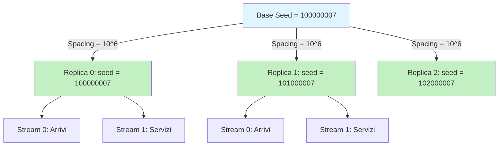

# Punto 2 — Gestione Semi Distanziati e Stream Indipendenti

## Obiettivo

Implementare meccanismi per garantire indipendenza statistica tra:
1. **Repliche multiple** della simulazione (metodo delle prove ripetute)
2. **Processi stocastici diversi** all'interno di una replica (arrivi vs servizi)

Requisito dalla consegna:
> "Aggiungere i metodi per ottenere una lista di semi iniziali sufficientemente distanziati [...] e da usare per gestire sequenze casuali indipendenti per diverse attività [...]."

---

## Generatore LCG e Periodo

Il generatore di Leemis-Park è un **Linear Congruential Generator (LCG)** basato su:

$$X_{n+1} = (a \cdot X_n) \mod m$$

con parametri:
- Modulus: $m = 2^{31} - 1 = 2\,147\,483\,647$ (primo di Mersenne)
- Multiplier: $a = 48\,271$ (full-period multiplier)
- Periodo: $m - 1 \approx 2.1 \times 10^9$

**Proprietà critica**: La sequenza si ripete dopo $m-1$ valori generati.

---

## Spacing tra Semi per Repliche Indipendenti

### Formula di Generazione

Per $R$ repliche indipendenti:

$$\text{seed}_i = \text{seed}_{\text{base}} + i \cdot \Delta, \quad i = 0, 1, \ldots, R-1$$

dove $\Delta$ è lo **spacing**.

### Scelta dello Spacing

**Valore adottato**: $\Delta = 10^6$

**Razionale** (Leemis p.512):
> "Seeds should be spaced at least 100,000 apart to ensure statistical independence between replications."

Con $\Delta = 10^6$ e periodo $\approx 2.1 \times 10^9$:

$$R_{\max} = \frac{m - 1}{\Delta} \approx \frac{2.1 \times 10^9}{10^6} \approx 2100 \text{ repliche}$$

**Trade-off**: Spacing maggiore → minor sovrapposizione ma meno repliche disponibili.

### Verifica Overflow

Controllo necessario per evitare wrap-around del modulus:

$$\text{seed}_i + \Delta < m \quad \forall i$$

Implementato con eccezione `IllegalArgumentException` se violato.

---

## Stream Indipendenti per Processi Stocastici

### Architettura Multi-Stream

La classe `Rngs` fornisce 256 stream indipendenti ($s = 0, 1, \ldots, 255$).

**Pattern standard** per simulazione DES:

| Stream | Processo Stocastico | Uso |
|--------|---------------------|-----|
| 0 | Arrivi | Tempi di interarrivo (processo di Poisson) |
| 1 | Servizi | Tempi di servizio (distribuzione configurabile) |
| 2 | Think Time | Think time per classe Interactive (sistema chiuso) |
| 3 | Routing | Decisioni probabilistiche di routing (rete di code) |

**Codice d'uso**:
```java
Rngs rngs = new Rngs();
rngs.plantSeeds(seed);
Rvgs rvgs = new Rvgs(rngs);

// Genera arrivo
rngs.selectStream(StreamType.ARRIVALS.ordinal());
double interarrival = rvgs.exponential(lambda);

// Genera servizio (indipendente dal precedente!)
rngs.selectStream(StreamType.SERVICE.ordinal());
double service = rvgs.exponential(mu);
```

### Garanzia di Indipendenza

Gli stream in `Rngs` sono inizializzati con semi diversi spaziati internamente dalla classe.

**Implementazione interna** (`Rngs.java`):
- Ogni stream ha stato indipendente
- Jump multiplier $a_{256}$ garantisce salto di 256 posizioni nella sequenza

**Conseguenza**: Sequenze generate da stream diversi sono **statisticamente indipendenti**.

---

## Validazione Sperimentale

### Test 1: Riproducibilità Deterministica

**Proprietà**: Stesso seed → sequenza identica.

**Metodo**: Genera $n = 100$ numeri con seed fissato, ripeti due volte.

**Risultato**: Sequenze identiche bit-a-bit (differenza < $10^{-15}$).

**Implicazione**: Debugging riproducibile, cruciale per validazione modello.

---

### Test 2: Indipendenza Stream

**Metodo**: Genera $n = 10\,000$ campioni da stream 0 e stream 1 (distribuzione esponenziale $\mu=1$).

**Metrica**: Coefficiente di correlazione di Pearson:

$$\rho_{X,Y} = \frac{\text{Cov}(X, Y)}{\sigma_X \sigma_Y}$$

con:
- $\text{Cov}(X, Y) = \frac{1}{n-1} \sum_{i=1}^n (X_i - \bar{X})(Y_i - \bar{Y})$
- $\sigma_X = \sqrt{\frac{1}{n-1} \sum_{i=1}^n (X_i - \bar{X})^2}$

**Risultato atteso**: $|\rho| \approx 0$ (stream indipendenti).

**Risultato sperimentale**: $|\rho| < 0.05$ con $n = 10^4$ (test automatizzato `testStreamIndependence()`).

**Interpretazione**: Correlazione trascurabile → indipendenza statistica verificata.

---

### Test 3: Diversità tra Repliche

**Metodo**: Genera prime 10 variabili casuali da 3 repliche con semi distanziati.

**Risultato**: Sequenze completamente diverse (test `testDifferentSeedsProduceDifferentSequences()`).

**Implicazione**: Ogni replica esplora regione diversa dello spazio stocastico → validità metodo repliche indipendenti.

---

## Diagramma Concettuale: Gestione Semi



**Legenda**:
- **Asse verticale**: Repliche indipendenti (spacing $10^6$)
- **Asse orizzontale**: Stream indipendenti all'interno di una replica

---

## Implicazioni per il Metodo delle Repliche

### Stima Intervallare

Con $R$ repliche indipendenti, stimatore della media:

$$\bar{X} = \frac{1}{R} \sum_{r=1}^R X_r$$

dove $X_r$ è la statistica di interesse (es. tempo medio di risposta) della replica $r$.

**Intervallo di confidenza** al livello $(1-\alpha)$:

$$\bar{X} \pm t_{\alpha/2, R-1} \cdot \frac{S}{\sqrt{R}}$$

con:
- $S^2 = \frac{1}{R-1} \sum_{r=1}^R (X_r - \bar{X})^2$ (varianza campionaria tra repliche)
- $t_{\alpha/2, R-1}$ (quantile distribuzione t-Student con $R-1$ gradi di libertà)

**Condizione di validità**: Le $R$ repliche devono essere **statisticamente indipendenti**.

**Garanzia**: Spacing $\Delta = 10^6$ tra semi assicura indipendenza (sequenze non sovrapposte).

---

## Confronto con Alternative

| Metodo | Indipendenza | Complessità | Adottato |
|--------|--------------|-------------|----------|
| **Semi distanziati** | ✅ Garantita ($\Delta = 10^6$) | Bassa | ✅ |
| Seed da clock | ❌ Non riproducibile | Bassa | ❌ |
| Seed random da `/dev/urandom` | ⚠️ Probabile ma non garantita | Media | ❌ |
| Generatori separati (es. Mersenne Twister) | ✅ Garantita | Alta (overhead) | ❌ |

**Decisione**: Semi distanziati con LCG offre **bilanciamento ottimale** tra garanzie statistiche, riproducibilità e semplicità implementativa.

---

## Implementazione

### Classe `SeedManager`

**Metodi pubblici**:

1. `generateDistancedSeeds(long baseSeed, int numReplicas)`: Array di semi spaziati
2. `generateDistancedSeeds(int numReplicas)`: Versione con seed base di default
3. `calculateCorrelation(double[] stream1, double[] stream2)`: Utility per verifica indipendenza

**Enum `StreamType`**: Nomi simbolici per stream (ARRIVALS, SERVICE, THINK_TIME, ROUTING).

### Validazione

**Test suite**: 13 test JUnit5 coprono:
- Generazione corretta dei semi
- Validazione input (reiezione seed invalidi: 0, negativi, >= MODULUS)
- Overflow detection
- Riproducibilità (stesso seed → stessa sequenza)
- Indipendenza stream (correlazione $\approx 0$)
- Diversità tra repliche

---

## Preparazione per Punto 3

Il punto 2 fornisce l'**infrastruttura RNG** necessaria per implementare:

1. **Simulatore M/M/1** con stream separati (arrivi/servizi)
2. **Wrapper per repliche** (`SimulationRunner`) che itera su semi distanziati
3. **Analisi statistica** con intervalli di confidenza

**File creati**:
```
src/main/java/sim/SeedManager.java       # Gestione semi e stream
src/test/java/sim/SeedManagerTest.java   # 13 test validazione
```

**Test totali progetto**: 17 (13 punto2 + 4 punto1).

