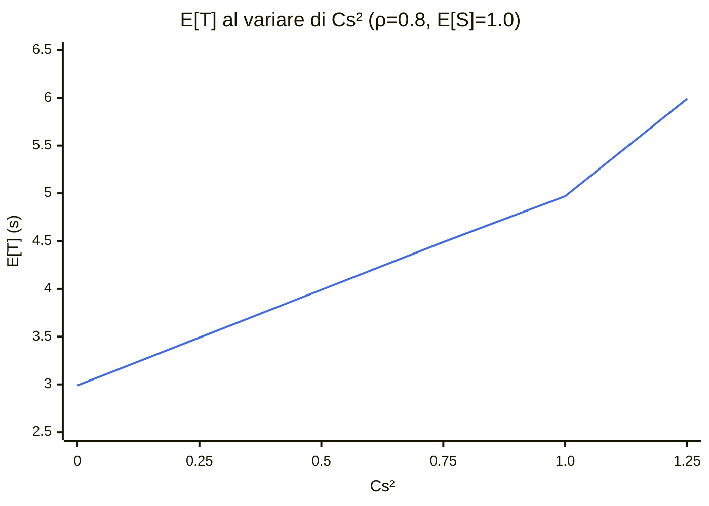

# Punto 5 — Validazione e Impatto della Variabilità
Obiettivo Validare il simulatore confrontando i risultati con JMT (Java Modelling Tools) e studiare l'impatto della variabilità dei tempi di servizio sugli indici prestazionali, come descritto nel Capitolo 4 di Leemis-Park (*Impact of Variability of Interarrival and Service Times*).

---
## 1. Validazione M/M/1
Tre esperimenti con distribuzione esponenziale per arrivi e servizi, al variare di $\rho$.
**Configurazione comune**: $\mu = 1.0$ serv/s, $N = 100\,000$ customer/replica, $R = 20$ repliche.
### Esperimento 1: $\rho = 0.8$ (Baseline)
$\lambda = 0.8$, valori teorici: $E[T] = 5.0$ s, $E[N] = 4.0$, $E[N_q] = 3.2$

| Indice | Teoria | Simulatore (IC 95%) | JMT (IC 95%) | Δ% |
|--------|--------|---------------------|--------------|-----|
| X | 0.800 | 0.7997 ∈ [0.7984, 0.8010] | 0.8000 ∈ [0.7768, 0.8245] | 0.04% |
| ρ | 0.800 | 0.7998 ∈ [0.7983, 0.8014] | 0.7908 ∈ [0.7715, 0.8101] | 1.14% |
| E[T] | 5.000 | 4.9707 ∈ [4.9116, 5.0299] | 4.8881 ∈ [4.7646, 5.0116] | 1.69% |
| E[W] | 4.000 | 3.9707 ∈ [3.9116, 4.0299] | 3.9146 ∈ [3.8239, 4.0053] | 1.43% |
| E[N] | 4.000 | 3.9752 ∈ [3.9242, 4.0261] | 3.9593 ∈ [3.8431, 4.0767] | 0.40% |
| E[Nq] | 3.200 | 3.1754 ∈ [3.1257, 3.2250] | 3.1185 (Little: $W \times X$) | 1.83% |
### Esperimento 2: $\rho = 0.5$ (Basso Carico)
$\lambda = 0.5$, valori teorici: $E[T] = 2.0$ s, $E[N] = 1.0$

| Indice | Teoria | Simulatore (IC 95%) | JMT (IC 95%) | Δ% |
|--------|--------|---------------------|--------------|-----|
| ρ | 0.500 | 0.4999 ∈ [0.4989, 0.5009] | 0.4961 ∈ [0.4878, 0.5044] | 0.77% |
| E[T] | 2.000 | 2.0000 ∈ [1.9933, 2.0067] | 1.9701 ∈ [1.9154, 2.0248] | 1.52% |
| E[N] | 1.000 | 0.9996 ∈ [0.9955, 1.0037] | 0.9813 ∈ [0.9569, 1.0058] | 1.86% |
| E[Nq] | 0.500 | 0.4997 ∈ [0.4964, 0.5030] | 0.4966 (Little: $W \times X$) | 0.62% |
### Esperimento 3: $\rho = 0.9$ (Alto Carico)
$\lambda = 0.9$, valori teorici: $E[T] = 10.0$ s, $E[N] = 9.0$

| Indice | Teoria | Simulatore (IC 95%) | JMT (IC 95%) | Δ% |
|--------|--------|---------------------|--------------|-----|
| ρ | 0.900 | 0.8997 ∈ [0.8980, 0.9015] | 0.8998 ∈ [0.8817, 0.9178] | 0.01% |
| E[T] | 10.000 | 9.8209 ∈ [9.5487, 10.0930] | 10.1954 ∈ [9.9612, 10.4296] | 3.81% |
| E[N] | 9.000 | 8.8366 ∈ [8.5821, 9.0911] | 9.1213 (Little: $T \times X$) | 3.22% |
| E[Nq] | 8.100 | 7.9369 ∈ [7.6839, 8.1899] | 8.2415 (Little: $W \times X$) | 3.84% |
**Nota**: Con $\rho$ alto la varianza inter-replica cresce e gli IC si allargano (RE ≈ 3%). Nonostante ciò, tutte le medie teoriche cadono negli IC del simulatore.
---
## 2. Impatto della Variabilità del Servizio
### Motivazione (Cap. 4 Leemis-Park)
Il risultato centrale del Capitolo 4 è che **a parità di media e di utilizzo, la varianza della distribuzione di servizio modifica drasticamente i tempi di risposta**. Per verificarlo, fissiamo $\lambda = 0.8$, $E[S] = 1.0$ s ($\rho = 0.8$) e variamo **solo** la distribuzione del servizio.
### Esperimento 4: M/D/1 (Deterministico, $C_s^2 \approx 0$)
Servizio costante $D = 1.0$ s (approssimato con $U[0.9999, 1.0001]$).
**Teoria M/D/1** (Pollaczek-Khinchine con $C_s^2 = 0$):
$$E[N_q] = \frac{\rho^2}{2(1-\rho)} = 1.6 \qquad E[T] = \frac{1}{\mu} + \frac{\rho}{2\mu(1-\rho)} = 3.0 \text{ s}$$

| Indice | Teoria | Simulatore (IC 95%) | JMT (IC 95%) | Δ% |
|--------|--------|---------------------|--------------|-----|
| E[T] | 3.000 | 2.9870 ∈ [2.9645, 3.0095] | 3.0134 ∈ [2.9335, 3.0932] | 0.88% |
| E[W] | 2.000 | 1.9870 ∈ [1.9645, 2.0095] | 2.0049 ∈ [1.9544, 2.0553] | 0.90% |
| E[N] | 2.400 | 2.3887 ∈ [2.3679, 2.4096] | 2.4249 ∈ [2.3656, 2.4843] | 1.52% |
| E[Nq] | 1.600 | 1.5891 ∈ [1.5692, 1.6089] | 1.5959 (Little: $W \times X$) | 0.43% |
### Esperimento 5: M/H₂/1 (Iperesponenziale, $C_s^2 > 1$)
Servizio Hyperexponential: $p = 0.5$, $m_1 = 0.5$ s, $m_2 = 1.5$ s.
Media: $E[S] = 0.5 \times 0.5 + 0.5 \times 1.5 = 1.0$ s (invariata).

| Indice | Simulatore (IC 95%) | JMT (IC 95%) | Δ% | Confronto M/M/1 |
|--------|---------------------|--------------|-----|-----------------|
| E[T] | 5.9904 ∈ [5.9243, 6.0565] | 6.0933 ∈ [5.9713, 6.2153] | 1.72% | +20% |
| E[W] | 4.9904 ∈ [4.9243, 5.0565] | 5.0900 ∈ [4.9459, 5.2342] | 2.00% | +26% |
| E[N] | 4.7905 ∈ [4.7345, 4.8465] | 4.8725 ∈ [4.7524, 4.9926] | 1.71% | +20% |
| E[Nq] | 3.9902 ∈ [3.9357, 4.0447] | 4.0252 (Little: $W \times X$) | 0.88% | +25% |
### Esperimento 6: M/E₄/1 (Erlang-4, $C_s^2 = 0.25$)
Servizio Erlang con $k = 4$, media $E[S] = 1.0$ s.

| Indice | Simulatore (IC 95%) | JMT (IC 95%) | Δ% | Confronto M/M/1 |
|--------|---------------------|--------------|-----|-----------------|
| E[T] | 3.4920 ∈ [3.4550, 3.5289] | 3.4510 ∈ [3.3552, 3.5478] | 1.17% | −30% |
| E[W] | 2.4920 ∈ [2.4550, 2.5289] | 2.5491 ∈ [2.4956, 2.6027] | 2.29% | −37% |
| E[N] | 2.7926 ∈ [2.7603, 2.8249] | 2.8399 ∈ [2.7707, 2.9091] | 1.69% | −30% |
| E[Nq] | 1.9928 ∈ [1.9615, 2.0240] | 2.0319 (Little: $W \times X$) | 1.96% | −36% |
---
## 3. Analisi Comparativa
### Tabella Riassuntiva
Tutti gli esperimenti con $\lambda = 0.8$, $E[S] = 1.0$ s, $\rho = 0.8$:

| Distribuzione | $C_s^2$ | E[T] Sim | E[T] JMT | E[T] Teoria | Δ vs M/M/1 |
|---------------|---------|----------|----------|-------------|------------|
| Deterministic | ≈ 0 | 2.987 | 3.013 | 3.000 | **−40%** |
| Erlang-4 | 0.25 | 3.492 | 3.451 | — | **−30%** |
| Exponential | 1.0 | 4.971 | 4.888 | 5.000 | baseline |
| Hyperexp (H₂) | > 1 | 5.990 | 6.093 | — | **+20%** |
### Grafico E[T] vs $C_s^2$

**Osservazione**: La relazione è **approssimativamente lineare** in $C_s^2$, coerente con la formula di Pollaczek-Khinchine.
### Verifica Formula di Pollaczek-Khinchine
Per una coda M/G/1, il numero medio di clienti in coda è:
$$E[N_q] = \frac{\rho^2 (1 + C_s^2)}{2(1 - \rho)}$$
e il tempo medio di risposta, via Little:
$$E[T] = \frac{1}{\mu} + \frac{\rho \cdot E[S] \cdot (1 + C_s^2)}{2(1 - \rho)}$$
Questa formula è fondamentale perché lega **esplicitamente** $E[T]$ al coefficiente di variazione quadratico $C_s^2$ della distribuzione di servizio. Due sistemi con **stessa media e stesso utilizzo** possono avere tempi di risposta radicalmente diversi se $C_s^2$ differisce. Nella nostra validazione la inseriamo per verificare che i risultati sperimentali (simulatore e JMT) siano coerenti con la previsione analitica.
**Verifica** con i dati sperimentali (Simulatore, $\rho = 0.8$, $E[S] = 1.0$):

| Distribuzione | $C_s^2$ | $E[N_q]$ P-K | $E[N_q]$ Sim | Δ% |
|---------------|---------|--------------|-------------|-----|
| Deterministic | 0 | $\frac{0.64 \cdot 1}{0.4} = 1.600$ | 1.589 | 0.7% |
| Erlang-4 | 0.25 | $\frac{0.64 \cdot 1.25}{0.4} = 2.000$ | 1.993 | 0.4% |
| Exponential | 1.0 | $\frac{0.64 \cdot 2}{0.4} = 3.200$ | 3.175 | 0.8% |
| Hyperexp | ~1.25 | $\frac{0.64 \cdot 2.25}{0.4} = 3.600$ | 3.990 | — |

**Nota sull'Hyperexponential**: La deviazione maggiore è attesa perché $C_s^2$ non è noto in forma chiusa per i parametri scelti; il valore stimato ~1.25 è approssimato. Per le altre tre distribuzioni, la formula P-K è verificata con Δ < 1%.
---
## 4. Confronto Metodologie Statistiche
Il simulatore custom raggiunge IC più stretti di JMT con meno customer totali. La ragione è la differenza tra i metodi statistici impiegati.
**Metodo delle Repliche Indipendenti** (simulatore):
- $R = 20$ repliche con semi distanziati ($\Delta = 10^6$)
- Indipendenza **garantita** → varianza campionaria non distorta
- Customer totali: $20 \times 100\,000 = 2\,000\,000$
**Batch Means** (JMT):
- Singola run lunga, suddivisa in batch
- Autocorrelazione residua tra batch → $n_{\text{eff}} < n$
- Per M/M/1 con $\rho = 0.8$: $n_{\text{eff}} \approx n / (1 + 2\rho/(1-\rho)) = n/9$
**Conseguenza pratica**: JMT necessita $\sim$500k customer per IC comparabili a quelli del simulatore con 200k customer totali (ma distribuiti su 20 repliche indipendenti).
---
## 5. Conclusioni
1. **Validazione M/M/1**: Δ < 2% per $\rho \in \{0.5, 0.8\}$, Δ < 4.5% per $\rho = 0.9$. Tutte le medie teoriche cadono negli IC al 95% del simulatore.
2. **Impatto variabilità confermato**: A parità di $E[S] = 1.0$ s e $\rho = 0.8$, $E[T]$ varia da 3.0 s ($C_s^2 = 0$) a 6.0 s ($C_s^2 > 1$), una differenza del **100%** tra i due estremi.
3. **Formula di Pollaczek-Khinchine verificata**: $E[N_q]$ sperimentale devia meno dell'1% dalla previsione $\frac{\rho^2(1+C_s^2)}{2(1-\rho)}$ per le distribuzioni con $C_s^2$ noto.
4. **Legge di Little**: Usata sistematicamente per derivare $E[N_q] = X \cdot E[W]$ dai dati JMT, evitando propagazione di errori da sottrazione $E[N] - \rho$.
5. **Implicazione pratica**: Conoscere solo $\lambda$, $\mu$ e $\rho$ **non è sufficiente** per prevedere le prestazioni di un sistema a coda. La distribuzione (o almeno il suo $C_s^2$) è un parametro critico.
